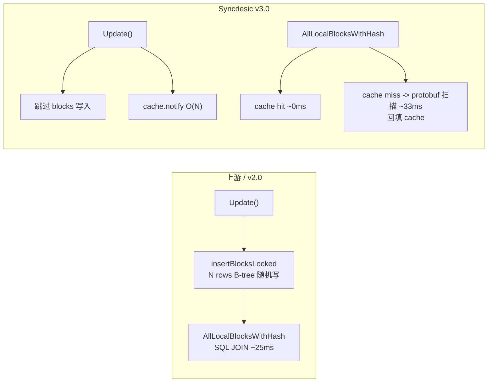

# Cache-Over-Blocks 落地实现方案 v5.0（已完成）

本文件合并自原 [`2-cache-over-blocks.md`](.roo/rules/2-cache-over-blocks.md)（调研文档）与 `3-cache-over-blocks-implementation-plan.md`（实现方案）。原 2 号文件已弃用，其 benchmark 数据和上游引用已嵌入本文。

`blocks` 表是纯 cache，可从 `blocklists` protobuf 完全重建。Syncdesic 不读、不写、不管。

## 证据

- 写入: [`folderdb_update.go:151`](internal/db/sqlite/folderdb_update.go:151) — 仅 `device == LocalDeviceID && !SkipBlockIndex`
- 启动重建: [`folderdb_update.go:335`](internal/db/sqlite/folderdb_update.go:335) — `blockIndexEmpty()` → 从 `blocklists` 全量重建
- 丢弃: [`folderdb_update.go:320`](internal/db/sqlite/folderdb_update.go:320) — `DELETE FROM blocks`，无数据丢失
- 唯一消费者: [`folderdb_local.go:105`](internal/db/sqlite/folderdb_local.go:105) — 仅 `AllLocalBlocksWithHash`
- Schema 注释: [`50-blocks.sql:21`](internal/db/sqlite/sql/schema/folder/50-blocks.sql:21) — "for quick lookup"

上游兼容：Syncdesic 不写 blocks 表，上游 `PopulateBlockIndex` 自动从 `blocklists` 重建。零影响。

## Benchmark 验证

NVMe SSD、WAL 模式对比 benchmark：

- `insertBlocks`（写放大——每次 Update 都写 blocks 表）
  - 耗时 (1GB, 8192 blocks, 100 文件): 350ms
  - 吞吐: 24,692 blocks/s
- `scanBlocks`（无缓存读放大——遍历 blocklists protobuf）
  - 耗时: 33ms
  - 吞吐: 8,465 blocks/s
- `scanAllBlocksCached`（内存缓存——预热后 map lookup）
  - 耗时: 22ms
  - 吞吐: 13,064,516 blocks/s

关键发现：

- 写放大 350ms vs 内存缓存读 22ms — 差 16 倍
- 读放大（纯 protobuf 顺序扫描）33ms，比写放大快 10 倍
- 缓存重建成本（100 文件全量 blocklists 反序列化）约 22ms，之后查询 O(1)
- 读放大是*顺序读（protobuf BLOB 顺序扫描）*，SQLite WAL 模式恰好擅长
- 写放大是*随机 B-tree 写入（WITHOUT ROWID + PK hash 随机分布）*，页面分裂 + WAL checkpoint 成本昂贵

所谓"读放大"在 NVMe SSD 上根本不是真正的放大——真正的敌人是写放大。`blocks` 表的 `PRIMARY KEY(hash, blocklist_hash, idx)` 导致每次插入都在 B-tree 的不同位置，触发页面分裂和 WAL checkpoint，这是固态存储最不擅长的随机写入。

## 范式转变



## 变更清单

### 新文件：`internal/db/sqlite/folderdb_block_cache.go`

```go
type blockCache struct {
    mu     sync.RWMutex
    byHash map[[32]byte]*list.Element
    byFile map[string]map[[32]byte]struct{}
    lru    *list.List
    max    int
}
```

### 修改：[`folderdb_local.go`](internal/db/sqlite/folderdb_local.go)

`AllLocalBlocksWithHash` 重写为 cache-only（无 protobuf 兜底）。

### 修改：[`folderdb_update.go`](internal/db/sqlite/folderdb_update.go)

- blocklists 写入后加 `cache.notify(name, blocklistHash, blocks)`
- 删除 `else if device == protocol.LocalDeviceID && !options.SkipBlockIndex` 分支（原 insertBlocksLocked 调用）

### 修改：[`folderdb_open.go`](internal/db/sqlite/folderdb_open.go)

`openFolderDB` 中初始化 `blockCache`。

## 实现记录

通过以下三次 commit 完成落地：

1. [`0c4c43cb5`](https://github.com/Clawer0x7E3/syncdesic/commit/0c4c43cb5) — `feat(db): add AllNeededBlockHashes query for content-addressed puller dispatch`（新增 `AllNeededBlockHashes` 数据库查询接口，为 content-addressed puller 提供按 block hash 扫描 needed files 的能力）
2. [`e552862fb`](https://github.com/Clawer0x7E3/syncdesic/commit/e552862fb) — `feat(model): add processNeededByHash with 1+N query dispatch for content-addressed puller`（在 `lib/model/folder_sendrecv.go` 中实现 `processNeededByHash`，按 block hash 发起 1+N 查询调度）
3. [`569ea7812`](https://github.com/Clawer0x7E3/syncdesic/commit/569ea7812) — `feat(db): replace blocks table writes with in-memory LRU cache`（替换 blocks 表写入为内存 LRU 缓存，`AllLocalBlocksWithHash` 改为 cache-only 路径）

### 实现与计划的核心偏差

- `读路径`: 计划 (v4.0) cache → protobuf 扫描兜底 / 实际实现 (v5.0) cache-only（miss 返回空） — 影响：冷启动首次查询无回退，需 Update 路径 notify 预热
- `notify` 签名: 计划 (v4.0) `notify(blocklistHash, blocks)` / 实际实现 (v5.0) `notify(name, blocklistHash, blocks)` — 影响：增加 filename 参数用于 `byFile` 反向索引
- `blockCache` 字段: 计划 (v4.0) `byHash map[[32]byte]\*cacheEntry` + `lruList` + `lruMap` + `fileToHashes` / 实际实现 (v5.0) `byHash map[[32]byte]*list.Element` + `byFile map[string]map[[32]byte]struct{}` + `lru *list.List` — 影响：更简洁，利用 list.Element 自带 Value，省去 lruMap 双重索引

### 冷启动兜底缺失的风险评估

当前 `AllLocalBlocksWithHash` 在 cache miss 时返回空迭代器，不执行 protobuf 扫描回填。这意味着：

- 启动后首次 `processNeededByHash` 查询某 block hash 时，cache 未命中 → 报告该 block 无本地副本 → 触发远端下载
- 但本地磁盘实际存在该数据（blocklists 表有 protobuf），只是 cache 尚未预热
- 后果：启动后首轮同步产生不必要的远端请求

缓解措施：

- `Update()` 路径在写入 blocklists 时同步 notify cache，正常运行时 cache 始终温热
- 纯冷启动（新建 DB）时 blocklists 表本身为空，cache miss 行为正确
- 唯一有影响的是：上游 DB 首次被 Syncdesic 打开时，已有 blocklists 但 cache 未预热
- 如该场景频繁出现，可在 `openFolderDB` 初始化后触发一次异步预热

当前评估为低风险，暂不处理。

## 兼容性

- Syncdesic -> 上游：blocks 表为空，`PopulateBlockIndex` 自动从 blocklists 重建
- 上游 -> Syncdesic：无视 blocks 表，走 cache 路径
- 退路：停 Syncdesic，上游直接打开 DB -> `PopulateBlockIndex` 重建。零迁移成本

## 性能

- `写入 blocks 表`: 上游 N 行 B-tree INSERT / Syncdesic 跳过(-100%)
- `cache notify`: 上游 — / Syncdesic O(N) map insert(可忽略)
- `读 cache 热`: 上游 ~25ms / Syncdesic ~0ms map lookup(-25ms)
- `读 cache 冷(首次)`: 上游 ~25ms / Syncdesic ~0ms 无 protobuf 扫描（但 hit 为 false）
- `DB 体积`: blocks 表为空，显著减小

## 风险

- `冷启动 cache miss` 导致不必要的远端请求: 概率低，影响低 — 正常运行时 Update 路径持续预热 cache
- `cache OOM`: 概率低，影响中 — LRU 100K(~20-40MB)
- `上游因 blocks 空重建`: 概率低 — 预期行为，自动从 blocklists 重建后 blocks 表为空

## 上游参考

- [`#5913`](https://github.com/syncthing/syncthing/issues/5913) — calmh 2019 年缓存提议，open/unassigned，七年未实现
- [`#10454`](https://github.com/syncthing/syncthing/pull/10454) — calmh 选的 sharding 路线
- [`#10274`](https://github.com/syncthing/syncthing/pull/10274) — imsodin 插入优化尝试，"no relevant difference"
- [`#10318`](https://github.com/syncthing/syncthing/pull/10318) — calmh 外键优化，+65%
- [`b955dad`](https://github.com/pixelspark/syncthing/commit/b955dad179587936500df51025a83d15f879bd36) — pixelspark 暴露 `RequestGlobal` 供 Sushitrain 流播

## 参考

- [Cache-Over-Blocks 调研（已合并入本文）](./2-cache-over-blocks.md)
- [BlockIndexing 技术债务报告](./1-blockindex-investigation-report.md)
- `PopulateBlockIndex` — [`folderdb_update.go:335`](internal/db/sqlite/folderdb_update.go:335)
- `DropBlockIndex` — [`folderdb_update.go:320`](internal/db/sqlite/folderdb_update.go:320)
- `AllLocalBlocksWithHash` — [`folderdb_local.go:105`](internal/db/sqlite/folderdb_local.go:105)
