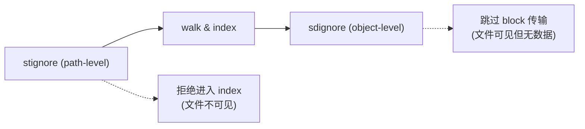
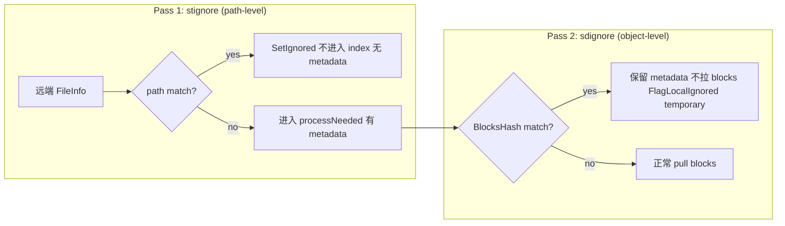

# Syncdesic Ignore System — 设计

> 本设计已推迟。当前优先级：完成 cache-over-blocks 与 puller 调度逻辑的完全重构后，再回头处理 ignore/VFS 集成。

## 问题

上游 ignore 系统自 2014 年未实质性演进。`.stignore` 用 `gobwas/glob` + 自创 `(?i)`/`(?d)` 前缀，issue `#2491`（Next Gen Ignores）frozen 关闭。根因是范式分歧：calmh 认为文件同步是路径匹配问题，Syncdesic 认为是内容寻址问题。上一轮 cache-over-blocks 在数据库层纠正此分歧，ignore 层需要对齐。

## 约束

- 不破坏 BEP 协议兼容性——Syncdesic 节点必须与上游互通
- `.stignore` 不能改名——上游不认识新文件名
- 不添加上游 DB schema——配置存平面文件

## 核心视角

`sdignore` 不是 `stignore` 的替代，是它的下游扩展。



两层正交，`stignore` 优先：

- `stignore`：门卫，决定哪些路径进 index
- `sdignore`：图书馆管理员，决定哪些书借出（block 传输），哪些只保留书目（metadata）
- 目标场景：stignore 决定扫描的大目录（`src/`），sdignore 标记其中某些内容（`.bin` 文件、已知大二进制）为 metadata-only

## 上游架构解剖

### 模块边界

`lib/ignore/`：`Matcher`（入口，持 `[]Pattern` + `*cache` + `ChangeDetector`）、`Pattern`（`glob.Glob` + `ignoreresult.R`）、`cache`（TTL 2h LRU-ish）、`ignoreresult.R`（uint8 位域：`ignoreBit | deletableBit | foldCaseBit | canSkipDirBit`）、`parseLine`/`parseIgnoreFile`。

### Pattern 编译两阶段

`foo/bar` 自动展开为两条 pattern：`"foo/bar"`（当前目录匹配）+ `` "/foo/bar" ``（递归匹配）。`/foo/bar` 不展开。100 行 `.stignore` 可能产生 200 个 Pattern，各含一个 `glob.Glob`。

### 匹配 hidden complexity

`Match(file)` O(n) 对 n 个 pattern。放大的因素：`canSkipDir` 逐 pattern 追踪、case-fold 触发 `strings.ToLower` 分配、`glob.Match` 非最快实现、缓存仅缓存最终结果不缓存 `canSkipDir`。

问题不在匹配速度，在匹配在错误时间被调用。

### `ignoreresult.R` 语义缺陷

仅 4 位，缺关键语义。用户真实意图：

- "暂时不想要但别删数据"（unpin）
- "永远不想要"（ignore + delete）
- "内容不要了但保留元数据"（content-level ignore）

第三个完全无法表达。

## 集成点审计

`lib/model/` 中 11 个调用点。

### 关键发现

`A. processNeeded 双重匹配`：`folder_sendrecv.go:167` 主线 + `467` handleFile 分支重复匹配，`canSkipDir` 计算完整重复。

`B. walker.go skipDir 假设`：被忽略目录下不可能有需取消忽略内容。content-level ignore 不打破此假设——`sdignore` 不参与 walk 决策，只参与 puller。

`C. folder.ignores 是 final 字段`：`type folder struct { ignores *ignore.Matcher }`。content-level ignore 必须有独立 Match 路径。

`D. LoadIgnores 每次新建 Matcher`：浪费 ChangeDetector 状态。

## 横向对比

- `rclone`：分层过滤最成熟（路径 glob、标记文件、metadata、name-hash filter）。纯 hash-based ignore 仍是空白。
- `Git`：构建时过滤，已有 content-addressed object store。`.gitignore` 不影响已 track 文件。启示：content-level ignore 在 CAS 系统中，"内容是否存在"和"路径是否同步"是正交维度。
- `CAS 系统`：忽略基于键（hash）的存在性。Syncdesic 的 cache-over-blocks 使 content-level ignore 自然——metadata 保留，block 传输跳过。
- `上游历史`：`#2491`（2015-2025 frozen）、`#2353`（stignore sync 被拒）。calmh 放弃大改但拒绝小步改进，十年真空。

## 设计：双重过滤

### 文件角色

- `.stignore`：上游兼容层，原封不动。语法、语义、加载机制不变
- `.sdignore`：Syncdesic 增强层。gitignore 标准语法 + content hash 扩展

### Content hash 扩展语法

```
# 按内容指纹忽略（不下载匹配的文件）
ch:sha256:e3b0c44298fc1c149afbf4c8996fb92427ae41e4649b934ca495991b7852b855

# 按块指纹忽略（不下载包含此 block 的文件）
bh:sha256:a1b2c3d4...

# 否定（取消忽略，正常下载）
!ch:sha256:abc...
```

`ch:` 匹配 `BlocksHash`（文件 block list 的 SHA-256），`bh:` 匹配单个 `Block.Hash`。选 `ch:`/`bh:` 前缀而非 `?ch`/`?bh` 原因：`?` 在 gitignore 中是单字符通配符，语义混淆；含冒号无扩展名形式不与合法路径冲突。

### 两层匹配流程



### `ignoreresult.R` 扩展

```go
const (
    ignoreBit      R = 1 << iota  // 现有
    deletableBit                   // 现有
    foldCaseBit                    // 现有
    canSkipDirBit                  // 现有
    contentIgnoredBit              // 新增：内容级忽略
)
```

- `IsIgnored() == true` 且 `IsContentIgnored() == true`：metadata 保留，数据不拉
- `processNeeded` 走 `SetIgnored` 路径但不触发本地删除
- 不触发 `handleDir` 的 `toIgnore` 批处理
- content-ignored 文件设 `FlagLocalIgnored` 但不设 `FlagLocalIgnoredPermanent`
- 对端更新内容时重新检查

### `folder` 字段扩展

```go
type folder struct {
    ignores       *ignore.Matcher         // .stignore，行为不变
    ignoresExt    *ignore.ExtendedMatcher // .sdignore content matcher
}

type ExtendedMatcher struct {
    content  *sdignore.ContentMatcher   // content hash 匹配 O(1)
}
```

扩展点集中在 `folder_sendrecv.go:processNeeded`，不修改 `walker.go`。

### 与 cache-over-blocks 集成

- `blockCache.get(hash)`：content-ignored block hash 返回 "not in cache"，跳过 block 请求
- `AllLocalBlocksWithHash`：cache 优先，用户取消 content ignore 后立即读取
- `processNeeded`：`dbUpdateInvalidate` 但不过期 blocklist

```go
// stignore path-level check (existing, unchanged)
case f.ignores.Match(file.Name).IsIgnored():
    file.SetIgnored()
    dbUpdateChan <- dbUpdateJob{file, dbUpdateInvalidate}
    continue

// sdignore object-level check (new)
case f.ignoresExt.MatchContent(file.BlocksHash).IsIgnored():
    file.SetIgnored()
    dbUpdateChan <- dbUpdateJob{file, dbUpdateInvalidate}
    // 不触发本地删除，保留 metadata，跳过 block request 队列
```

### REST API

复用 `/rest/db/ignores`。`GET` 返回 `{"ignore": lines, "expanded": patterns, "sdignore": lines}`。`POST` 接受 `{"ignore": lines, "sdignore": lines}`。

### 兼容性

- 上游 + 上游：一切如常
- Syncdesic + 上游（无 `.sdignore`）：退化上游行为
- Syncdesic + Syncdesic：content ignore 生效
- Syncdesic + 上游（有 `.sdignore`）：上游不识别 `.sdignore`，功能无损
- 上游 + Syncdesic：Syncdesic 端 content ignore 不影响上游，远端正常推送

`.sdignore` 不参与同步，与 `.stignore` 一样是 device-local 配置。

### 作用域边界：DB 级 vs 文件系统级

当前"metadata 保留"仅限 DB 层面——Syncdesic index 中有记录（路径、hash、modtime），远端知其存在、不会删除。但本地磁盘上文件不存在，用户打开文件夹看不到它。

若要做到"文件可见但数据不落地"（stub），需 FUSE 挂载（WinFsp/macFUSE/libfuse）或 symlink。两者通常需要管理员/开发者权限，是独立 feature，不在本设计当前范围内。

content-ignored 文件的用户可见性：

1. `文件完全不可见`：本设计默认行为。无特权要求，远端 metadata 保留。弱点：用户困惑"同步了但文件呢"
2. `文件可见但 stub`（FUSE 层）：未来 feature。完全按需拉取 block，用户感知类似云端占位文件
3. `文件可见但 symlink`：第三方可能性。符号链接指向特殊路径（如 `.stfolder/objects/HASH`），点击跳转或报错

## 实施路径

### Phase 0: 基础设施（2-3 days）

- `lib/ignore/ignoreresult/` 新增 `contentIgnoredBit` + `IsContentIgnored()`/`WithContentIgnored()`

### Phase 1: 解析器（3-4 days）

- `lib/sdignore/` 包：gitignore 兼容解析器（基于 `go-gitignore`）+ `ch:`/`bh:` 扩展 + `ContentMatcher`（`map[[32]byte]bool` O(1)）+ 完整测试

### Phase 2: Matcher 集成（2-3 days）

- `lib/ignore/` 新增 `ExtendedMatcher`
- `folder.go` 新增 `ignoresExt` 字段
- `model.go` 加载 `.sdignore`，`LoadIgnores`/`setIgnores` 同时处理

### Phase 3: Puller 集成（2-3 days）

- `folder_sendrecv.go:processNeeded` 追加 `MatchContent`
- content-ignored 走 `SetIgnored` 但不触发删除
- block request 调度跳过

### Phase 4: REST API & GUI（1-2 days）

- `getDBIgnores`/`postDBIgnores` 扩展

### Phase 5: 端到端测试（2-3 days）

- `.sdignore` 解析、`ContentMatcher`、`ExtendedMatcher` 合并、content ignore 全链路、上游兼容

## 风险

- `.sdignore` 被上游节点同步为普通文件：概率中，影响低。不参与同步，误同步不解释
- `ContentMatcher` 内存增长：概率低，影响中。LRU 限制
- content-ignored 文件被用户误删：不影响，视同正常删除
- 上游 `PopulateBlockIndex` 拉取 content-ignored 数据：概率低，影响高。Syncdesic 跳过 `blocks` 表写入，`PopulateBlockIndex` 从 `blocklists` protobuf 重建——不触发网络请求

## 与上游关系

- 不改 `.stignore` 任何行为
- 不改 BEP 协议
- 不改 `lib/protocol/`
- 不改 DB schema

完全可逆：删 `.sdignore` 退化为上游行为。

## 未解决问题

- 跨设备 `.sdignore` 同步：`#include` 引用同步文件是否足够？
- 白名单模式：`!ch:` 否定模式是否需要？
- 扫描阶段 content hash 获取：`walk.go` 目前 contentChanged 时才计算 hash，content-level ignore 是否强制计算？
- `ContentMatcher` 持久化：重启后保留或与 `.sdignore` 同步重新生成？

留待 Phase 0 完成后的实现评审中决定。
