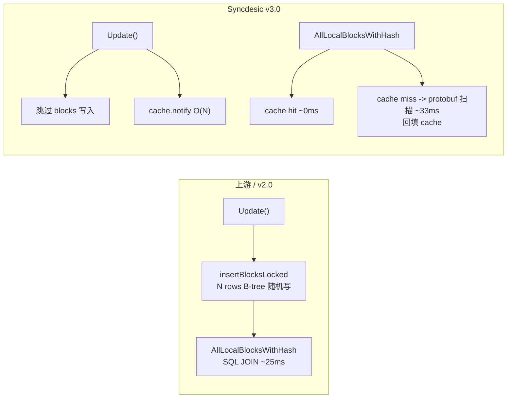

# Cache-Over-Blocks 落地实现方案 v4.0

本文件合并自原 [`2-cache-over-blocks.md`](.roo/rules/2-cache-over-blocks.md)（调研文档）与 `3-cache-over-blocks-implementation-plan.md`（实现方案）。原 2 号文件已弃用，其 benchmark 数据和上游引用已嵌入本文。

`blocks` 表是纯 cache，可从 `blocklists` protobuf 完全重建。Syncdesic 不读、不写、不管。

## 证据

- 写入: [`folderdb_update.go:151`](internal/db/sqlite/folderdb_update.go:151) — 仅 `device == LocalDeviceID && !SkipBlockIndex`
- 启动重建: [`folderdb_update.go:335`](internal/db/sqlite/folderdb_update.go:335) — `blockIndexEmpty()` → 从 `blocklists` 全量重建
- 丢弃: [`folderdb_update.go:320`](internal/db/sqlite/folderdb_update.go:320) — `DELETE FROM blocks`，无数据丢失
- 唯一消费者: [`folderdb_local.go:105`](internal/db/sqlite/folderdb_local.go:105) — 仅 `AllLocalBlocksWithHash`
- Schema 注释: [`50-blocks.sql:21`](internal/db/sqlite/sql/schema/folder/50-blocks.sql:21) — "for quick lookup"

上游兼容：Syncdesic 不写 blocks 表，上游 `PopulateBlockIndex` 自动从 `blocklists` 重建。零影响。

## Benchmark 验证

NVMe SSD、WAL 模式对比 benchmark：

- `insertBlocks`（写放大——每次 Update 都写 blocks 表）
  - 耗时 (1GB, 8192 blocks, 100 文件): 350ms
  - 吞吐: 24,692 blocks/s
- `scanBlocks`（无缓存读放大——遍历 blocklists protobuf）
  - 耗时: 33ms
  - 吞吐: 8,465 blocks/s
- `scanAllBlocksCached`（内存缓存——预热后 map lookup）
  - 耗时: 22ms
  - 吞吐: 13,064,516 blocks/s

关键发现：

- 写放大 350ms vs 内存缓存读 22ms — 差 16 倍
- 读放大（纯 protobuf 顺序扫描）33ms，比写放大快 10 倍
- 缓存重建成本（100 文件全量 blocklists 反序列化）约 22ms，之后查询 O(1)
- 读放大是*顺序读（protobuf BLOB 顺序扫描）*，SQLite WAL 模式恰好擅长
- 写放大是*随机 B-tree 写入（WITHOUT ROWID + PK hash 随机分布）*，页面分裂 + WAL checkpoint 成本昂贵

所谓"读放大"在 NVMe SSD 上根本不是真正的放大——真正的敌人是写放大。`blocks` 表的 `PRIMARY KEY(hash, blocklist_hash, idx)` 导致每次插入都在 B-tree 的不同位置，触发页面分裂和 WAL checkpoint，这是固态存储最不擅长的随机写入。

## 范式转变



## 写路径

[`folderdb_update.go:151`](internal/db/sqlite/folderdb_update.go:151) — 永久跳过 blocks 分支。

推荐实现：配置 `BlockIndexing: false`（零代码改动），上游 `reconcileBlockIndex` 自动 `DropBlockIndex`。

blocklists 写入后加 cache notify：

```go
s.blockCache.notify(f.BlocksHash, f.Blocks)
```

## 读路径

重写 [`AllLocalBlocksWithHash`](internal/db/sqlite/folderdb_local.go:105)：cache 优先 -> protobuf 扫描兜底。

```sql
SELECT f.name, bl.blprotobuf, f.blocklist_hash
FROM files f
INNER JOIN blocklists bl ON bl.blocklist_hash = f.blocklist_hash
WHERE f.device_idx = ? AND f.blocklist_hash IS NOT NULL
```

反序列化 `blprotobuf` 匹配目标 hash，回填 cache。

## 一致性

- 数据源 = `blocklists protobuf` = ground truth，无一致性问题
- 失效：`Update()` 本地文件更新 -> `invalidateFile(name)` 清除相关条目
- 无 TTL：文件不变时 cache 永远有效
- 冷启动 cache 空 -> 首次查询触发热填充

## 变更清单

### 新文件：`internal/db/sqlite/folderdb_block_cache.go`

```go
type blockCache struct {
    mu     sync.RWMutex
    byHash map[[32]byte]*cacheEntry
    lruList *list.List
    lruMap  map[[32]byte]*list.Element
    fileToHashes map[string]map[[32]byte]struct{}
    maxSize int // default 100000
}

func (c *blockCache) get(hash [32]byte) ([]db.BlockMapEntry, bool)
func (c *blockCache) set(hash [32]byte, locations []db.BlockMapEntry)
func (c *blockCache) notify(blocklistHash []byte, blocks []protocol.BlockInfo)
func (c *blockCache) invalidateFile(name string)
func (c *blockCache) clear()
```

### 修改：[`folderdb_local.go`](internal/db/sqlite/folderdb_local.go)

`AllLocalBlocksWithHash` 重写为 cache -> protobuf 两级。

### 修改：[`folderdb_update.go`](internal/db/sqlite/folderdb_update.go)

- blocklists 写入后加 `cache.notify`
- 删除 `else if device == protocol.LocalDeviceID && !options.SkipBlockIndex` 分支

### 修改：[`folderdb_open.go`](internal/db/sqlite/folderdb_open.go)

`openFolderDB` 中初始化 `blockCache`。

## 兼容性

- Syncdesic -> 上游：blocks 表为空，`PopulateBlockIndex` 自动从 blocklists 重建
- 上游 -> Syncdesic：无视 blocks 表，走 cache -> protobuf 路径
- 退路：停 Syncdesic，上游直接打开 DB -> `PopulateBlockIndex` 重建。零迁移成本

## 性能

- 写入 blocks 表: 上游 N 行 B-tree INSERT / Syncdesic 跳过(-100%)
- cache notify: 上游 — / Syncdesic O(N) map insert(可忽略)
- 读 cache 热: 上游 ~25ms / Syncdesic ~0ms map lookup(-25ms)
- 读 cache 冷(首次): 上游 ~25ms / Syncdesic ~33ms protobuf 扫描(+8ms)
- 读 cache 冷(后续同文件): 上游 ~25ms / Syncdesic ~0ms 已回填(-25ms)
- DB 体积: blocks 表为空，显著减小

## 实现路径

- Phase 1 (P0): `folderdb_block_cache.go` 新建 + `folderdb_local.go` 读路径 + `folderdb_open.go` 初始化
- Phase 2 (P0): `folderdb_update.go` 写路径 hook + cache notify；确认 `lib/model/folder.go` 中 `reconcileBlockIndex`
- Phase 3 (P1): 测试 `TestBlockCacheBasic`、`TestAllLocalBlocksWithHash`、`TestNoBlocksTableWrite`；性能 benchmark

## 风险

- protobuf 扫描退化(数千文件): 概率中，影响高 — 加 `(device_idx)` 索引；cache 回填后 O(1)
- cache OOM: 概率低，影响中 — LRU 100K(~20-40MB)
- 并发扫描风暴: 概率中，影响中 — `syncsingleflight` 去重
- 上游因 blocks 空重建: 概率低 — 预期行为

## 未解决

- `ScanAllLocalBlocksWithHash` 是否依赖 blocks 表？需确认
- `folderdb_update.go` blocks 路径变动需维护 sync patch

## 上游参考

- [`#5913`](https://github.com/syncthing/syncthing/issues/5913) — calmh 2019 年缓存提议，open/unassigned，七年未实现
- [`#10454`](https://github.com/syncthing/syncthing/pull/10454) — calmh 选的 sharding 路线
- [`#10274`](https://github.com/syncthing/syncthing/pull/10274) — imsodin 插入优化尝试，"no relevant difference"
- [`#10318`](https://github.com/syncthing/syncthing/pull/10318) — calmh 外键优化，+65%
- [`b955dad`](https://github.com/pixelspark/syncthing/commit/b955dad179587936500df51025a83d15f879bd36) — pixelspark 暴露 `RequestGlobal` 供 Sushitrain 流播

## 参考

- [Cache-Over-Blocks 调研（已合并入本文）](./2-cache-over-blocks.md)
- [BlockIndexing 技术债务报告](./1-blockindex-investigation-report.md)
- `PopulateBlockIndex` — [`folderdb_update.go:335`](internal/db/sqlite/folderdb_update.go:335)
- `DropBlockIndex` — [`folderdb_update.go:320`](internal/db/sqlite/folderdb_update.go:320)
- `AllLocalBlocksWithHash` — [`folderdb_local.go:105`](internal/db/sqlite/folderdb_local.go:105)
