# 提案 5：异步并行块交付

## 1. 问题

syncthing 的调度逻辑在两个地方卡了脖子：

- [`pullerRoutine`](lib/model/folder_sendrecv.go:1657) 的 `requestLimiter` 是 `semaphore.New(f.PullerMaxPendingKiB * 1024)`。默认 128 KiB，只够 2 个 64 KiB 块同时 inflight。高延迟链路完全喂不饱。
- [`pullBlock`](lib/model/folder_sendrecv.go:1696) 在循环里一次只拉一个 block，同一个文件的多个块必须串行。`rawConnection.Request()` 本身走 ID-based async matching，同一连接挂几百个 inflight request 毫无压力——但上层调度把这能力浪费了。

顺便捎上两个弱智设计：

- [`requestConnectionForDevice`](lib/model/model.go:2469) 在多连接时从非主连接里随机挑一个。慢连接被选中的概率和快连接一样大。
- [`leastBusy`](lib/model/deviceactivity.go:30) 只数请求数，不看 RTT、吞吐量。

## 2. 当前流水线

```mermaid
flowchart LR
    PNH["processNeededByHash"] --> HF["handleFile"]
    HF --> CC["copyChan"]
    CC --> CR["copierRoutine"]
    CR --> PC["pullChan"]
    PC --> PR["pullerRoutine"]
    PR --> PB["pullBlock (单文件串行)"]
    PB --> RG["RequestGlobal"]
    RG --> RL["requestLimiter (128 KiB 硬上限)"]
    RL --> LB["leastBusy (数数)"]
    LB --> RC["requestConnectionForDevice (随机选)"]
```



`copierRoutine` 的并发度可配，但 `pullerRoutine` 的并发度被信号量卡死。`processNeededByHash` 绕过了 queue 管线，但 pull 阶段的并发模型没跟着动。

## 3. 方案

就两刀。

### 第一刀：砍信号量，批拉

`requestLimiter` 的 128 KiB 是历史遗留，直接提到 `PullerMaxPendingKiB` 的 16 MiB 硬上限。或者删了信号量，改成 `PullBlockBatchSize` 统一控并发。

```go
// 改前
requestLimiter := semaphore.New(f.PullerMaxPendingKiB * 1024)
err := pullBlock(ctx, state, conn, f)

// 改后——同一文件的 N 个 block 一次全扔出去
state.blockStates = append(state.blockStates, newBlockState(b, i))
if len(state.blockStates) >= batchSize {
    dispatchBlocks(ctx, state.blockStates, conn)
    state.blockStates = state.blockStates[:0]
}
```

`dispatchBlocks` 对每个 block 调 `RequestGlobal`——里面的 `rawConnection.Request()` 用 ID 匹配，几个 request 同时等 response 毫无问题。收到数据直接按 block index 写回对应 offset。

**为什么不用什么 `PullerPendingCache`、`bandwidthWindow`？**  
因为 `rawConnection.Request()` 的并发模型已经无限了。不需要再加一层结构体来"管理"本不存在的瓶颈。一张信号量设大点，一个循环把 block 全扔出去，收工。

### 第二刀：选最快连接

`requestConnectionForDevice` 现在这行：

```go
idx := rand.Intn(len(connIDs)-1) + 1
```

改成记每条连接的最近 RTT，挑最短的那条。`handleResponse` 里顺手记个时间戳，几十行代码：

```go
type connStats struct {
    lastRTT time.Duration
    updated time.Time
}
```

`leastBusy` 不改。数请求数在 RTT 加权后已经不是必选项，YAGNI。

**不做的：**

- `PullerPendingCache` / `bandwidthWindow` / `adaptiveController` EMA 窗口
- `weightedLeastBusy`
- `streamFileDetector` 优先级池
- `blockPullReorderer` streaming 模式
- 新配置项

## 4. Vibe Coding 实施步骤

**总工期：两天，含摸鱼。**

`Day 1 下午（实际动手 3h）：` 找到 `folder_sendrecv.go` 里 `pullerRoutine` 和 `pullBlock` 的位置。把 `requestLimiter` 阈值提到 16 MiB，或者在拉流文件时直接 bypass。改 `pullBlock` 循环——不一个一个等了，凑够一批 block 全部 `RequestGlobal`。`rawConnection.Request()` 本身异步，改完就生效。`handleResponse` 里把返回的 block 按 index 写文件。over。

`Day 2 上午（实际动手 1h）：` 找到 `model.go` 里 `requestConnectionForDevice`。把 `rand.Intn` 改成遍历可用连接，记最近一个 response 的耗时，挑最小的。`handleResponse` 在 `model.go` 的 `RequestGlobal` 返回处加两行时间戳记录。over。

`下午：` 测试。找个 4GB 视频文件，开两台机器对拉，看读头能不能跑到远端网卡上限。跑不到就调大 `PullBlockBatchSize`，或者把 `MaxRequestKiB` 加到设备配置里。

## 5. 预期效果

- `并发窗口`: 128 KiB → 16 MiB（或不限）
- `同文件块并行度`: 1 → `batchSize`（默认 4-8）
- `设备选择`: 随机 → RTT 最短
- `首次块延迟`: ~1 RTT → ~1 RTT（不变）
- `卡顿率`: 高 → 低

## 6. 风险

- `内存`: 16 MiB 是极限。一个文件全拉也就 16 MiB，不会炸。
- `乱序写入`: 流式文件要求按序。`dispatchBlocks` 时按 offset 排序发出，写入时用 offset 定位——写同一文件的不同位置天然不冲突。
- `后台饿死`: 当前不改优先级。等真有人碰到了再补。

## 7. 兼容性

- BEP 协议：不变
- DB schema：不变
- API：无新增
- 配置：无新增

## 8. 参考

- [`rawConnection.Request`](lib/protocol/protocol.go:350) — ID-based async matching，支持同连接多并发
- [`requestConnectionForDevice`](lib/model/model.go:2469) — 随机选连接，改之
- upstream PR `#10678` — 设备选择改进（基于吞吐量）
- pixelspark/sushitrain — 流式播放绕过上层调度
